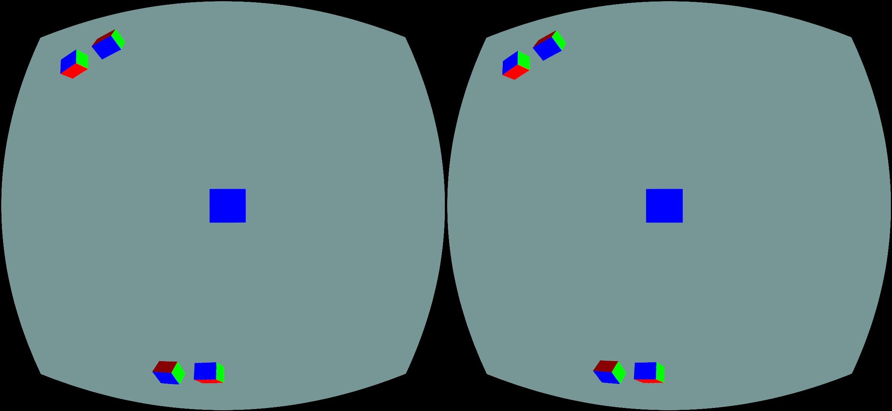
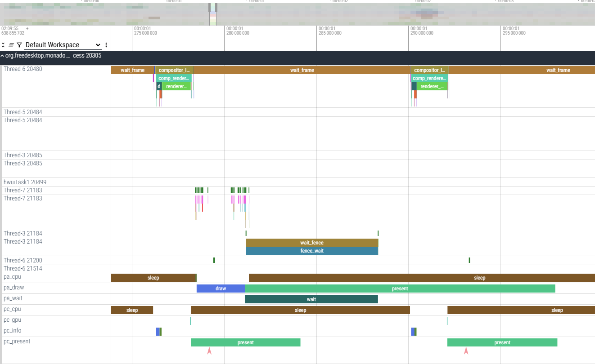

# Monado Android Runtime Feature Overview

Monado provides a complete XR solution for the Android platform, based on the open-source Monado project with native support for OpenXR. It runs smoothly on Android and offers the following key features:

## 1. Single Buffer Rendering
Supports single-buffer rendering that directly outputs to the display buffer, minimizing display latency and enabling low-latency rendering.

## 2. Real-Time 3DoF Pose Fusion
Enhances pose prediction accuracy through real-time 3DoF sensor fusion. Offers better performance than Monado’s default fusion algorithm and supports magnetic fusion and online IMU calibration.

## 3. Comprehensive Debugging and Profiling
Integrates well with **Perfetto** to capture `systrace`, enabling in-depth analysis of system-wide runtime behavior.

## 4. Accurate Distortion Correction
Provides a complete distortion correction solution. Using Monado’s built-in distortion algorithms along with guided documentation, developers can achieve accurate visual corrections.

## 5. Improved Rendering Pipeline and Prediction
Optimized rendering and prediction pipeline delivers more accurate timing, lower latency, and smoother experiences—reducing the risk of motion sickness.

## 6. Out-of-Process Multi-Process Architecture
Supports an out-of-process architecture, improving compatibility and stability on Android. Enables multiple concurrent processes and supports advanced use cases like overlay sessions.

## 7. SoC-Level Optimization
Includes specific optimizations for SoC platforms (e.g., Qualcomm), improving GPU performance and reducing runtime power consumption.

## 8. Detailed Technical Documentation
Comprehensive documentation is available to help developers understand Monado's workflow and threading model, aiding in effective debugging and maintenance of the Monado source code.

# How to run

1.Install openxr_android-outOfProcess-debug.apk installable_runtime_broker-dev-debug.apk hello_xr-OpenGLES-debug.apk

2.Make sure runtime_broker and monado runtime has auto-start permissions

3.Run hello_xr-OpenGLES-debug.apk

# Screenshots

Below are some runtime screenshots showcasing the Monado Android Runtime in action:

## OpenXR Hello XR Example (OpenGL ES)

This screenshot demonstrates the `hello_xr` sample application running with OpenGL ES on Android, rendered through the Monado runtime.

## System Trace via Perfetto

Captured using Perfetto, this system trace visualizes the end-to-end execution timeline for debugging and performance profiling.
