moando Android 版本画面延迟比较高，本文将分析monado的帧预测机制，并尝试改善其延迟。

# 姿态获取接口
device驱动提供获取预测姿态的接口，monado的帧预测都是通过调用下面接口获取期望时间的pose。

```c
	/*!
	 * @brief Get relationship of a tracked device to the tracking origin
	 * space as the base space.
	 *
	 * It is the responsibility of the device driver to do any prediction,
	 * there are helper functions available for this.
	 *
	 * The timestamps are system monotonic timestamps, such as returned by
	 * os_monotonic_get_ns().
	 *
	 * @param[in] xdev           The device.
	 * @param[in] name           Some devices may have multiple poses on
	 *                           them, select the one using this field. For
	 *                           HMDs use @p XRT_INPUT_GENERIC_HEAD_POSE.
	 *                           For Unbounded Reference Space you can use
	 *                           @p XRT_INPUT_GENERIC_UNBOUNDED_SPACE_POSE
	 *                           to get the origin of that space.
	 * @param[in] at_timestamp_ns If the device can predict or has a history
	 *                            of positions, this is when the caller
	 *                            wants the pose to be from.
	 * @param[out] out_relation The relation read from the device.
	 *
	 * @see xrt_input_name
	 */
	xrt_result_t (*get_tracked_pose)(struct xrt_device *xdev,
	                                 enum xrt_input_name name,
	                                 int64_t at_timestamp_ns,
	                                 struct xrt_space_relation *out_relation);
```
这个接口通常会在两种情况下调用：
1.APP通过IPC调用获取姿态
2.Compositor在合成的时候获取姿态
									 
## 	APP通过IPC调用获取姿态
APP在渲染帧的时候会调用xrLocateSpace或xrLocateViews来获取姿态，同时会传入预测时间。
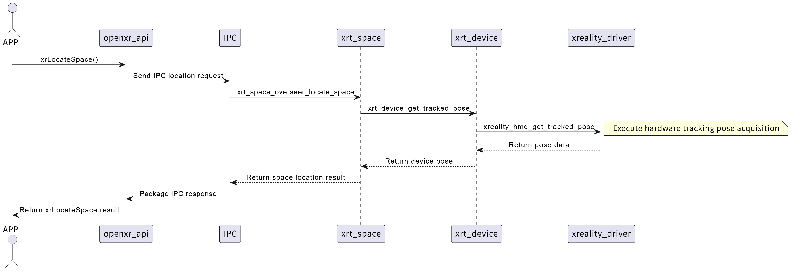
unity为多线程模型，UnityMain线程调用locateSpace接口，在帧开始的时候获取姿态，这个时候预测的时间比较久，大概42ms，
在Render线程提交帧的时候，在通过locateView获取姿态，预测时间为29.7ms，也就是了CPU阶段耗时11ms之后，重新预测提交帧的姿态，这样也有助于降低延迟，也就是说渲染线程提交帧预测时长久30ms左右。
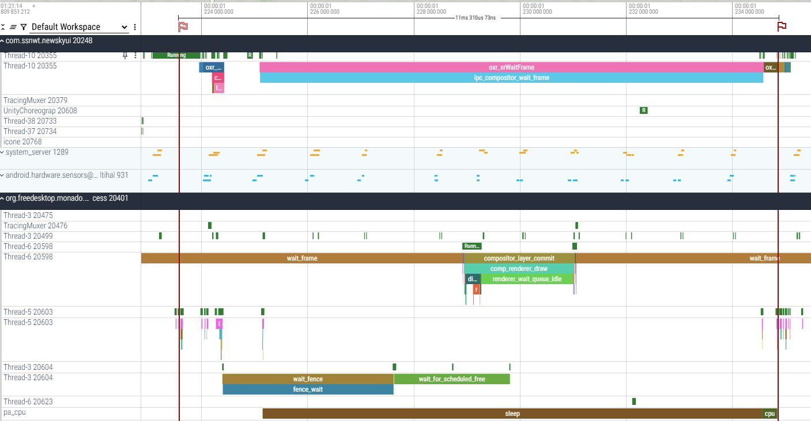

而Native应用如HelloXR，只有一个主线程，获取姿态都在一个线程中完成。
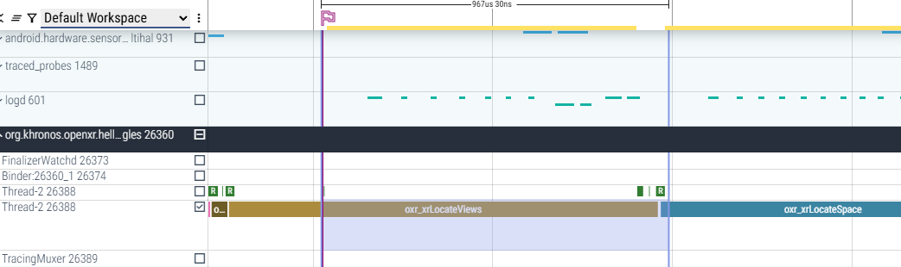


## Compositor在合成的时候获取姿态

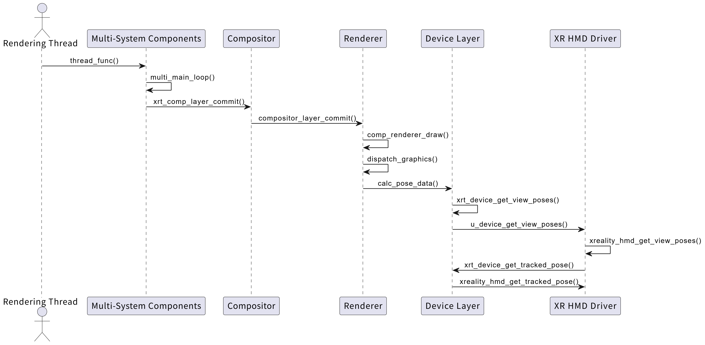

compositor渲染线程，预测时间7.9ms
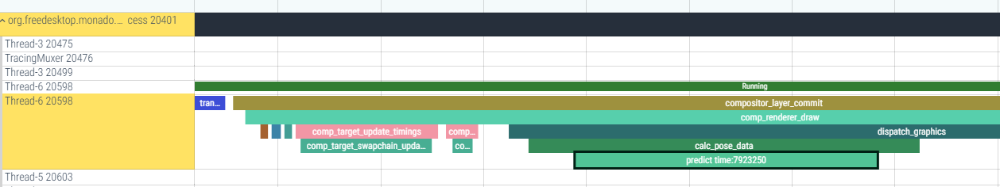


# Frame Pacing 帧时间管理
Frame Pacing模块控制着帧节奏/时序，帧主要有以下状态：

1. Sleep的时间点
事件	时间点变量	说明
预测睡眠开始	f->when.predicted_ns	Monado 预测 CPU 应该进入休眠的时间（基于历史帧数据优化功耗）。
实际唤醒时间	f->when.wait_woke_ns	CPU 实际被唤醒的时间（可能因系统调度延迟晚于预测值）。


2. CPU 处理阶段（应用逻辑）
事件	时间点变量	说明
CPU 开始工作	cpu_start_ns	唤醒后立即开始处理（wait_woke_ns + 1 避免时间重叠）。
CPU 结束工作	f->when.begin_ns	CPU 完成帧数据处理（如应用逻辑、提交渲染命令）。

3. GPU 绘制阶段
事件	时间点变量	说明
GPU 开始绘制	f->when.begin_ns	CPU 提交绘制命令后，GPU 开始渲染的时间。
GPU 预期完成	f->predicted_gpu_done_time_ns	Monado 预测 GPU 应完成渲染的时间（用于判断是否延迟）。
GPU 实际完成	f->when.delivered_ns	GPU 实际完成渲染的时间（若晚于预测值，标记为 "late"）。

4. 等待阶段（同步 GPU）
事件	时间点变量	说明
开始等待 GPU	f->when.delivered_ns	GPU 渲染完成后，等待结果同步到显示子系统的时间。
GPU 最终完成	f->when.gpu_done_ns	GPU 所有工作（包括显示提交）完成的最终时间。

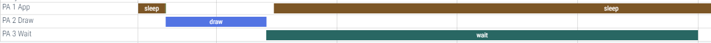

PA Sleep----->oxr_xrWaitFrame
PA Draw-->oxr_xrBeginFrame到oxr_xrEndFrame的时间长度
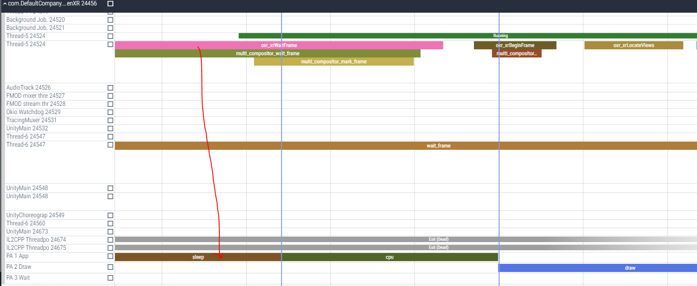

oxr_xrEndFrame结束draw结束
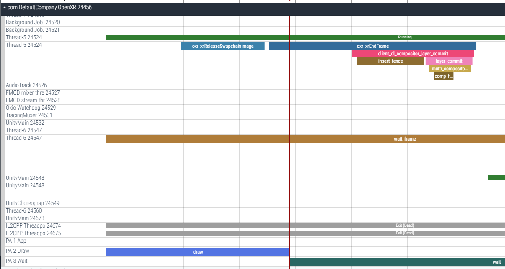

PA wait是等待GPU绘制的时间，等GPU绘制完成后，fence唤醒，wait结束，注意这个wait的线程名是unity main，但实际是compositor waiter线程
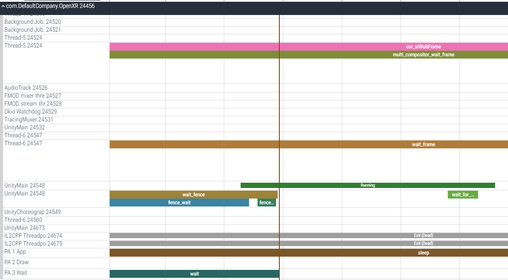


## Compositor的帧同步
compositor中也是类似，也是PC sleep->PC draw->PC present，其中present为预测的屏幕scanout的时间。
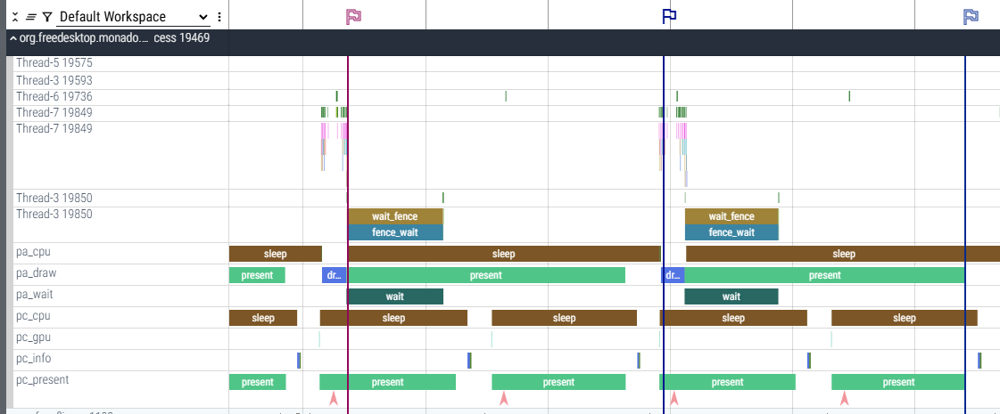

# 完整的一帧延迟
下图为应用从渲染帧开始绘制到提交合成，合成后上屏显示的整个过程。
其中第一个旗子到第二个是绘制到开始提交，第二个到第三个是提交后合成到上屏。
第一个旗子：帧开始，CPU运行准备渲染数据，调用xrt_device_get_tracked_pose接口进行姿态预测，xrt device drvier里面打印预测的时间为30ms
第二个旗子：compositor显示完上一帧，开始取当前提交的帧进行合成
第三个旗子：compositor合成新帧，并完成上屏显示，用systrace测量第一个旗子到第三个时间为30ms，预测符合实际显示的时间。
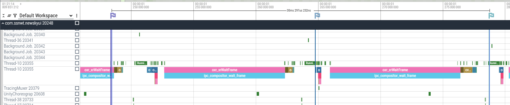

# 总结
关于延时Tunning，可以从主观和客观方面评价。
主观方面：
1.如果画面拖拽感比较强，就是延迟比较大，需要增加预测时间（最开始monado就是这种情况）
2.运行hellox看视野中心的cube，会不会有重影，如果有重影那预测也是有问题的，预计是出现了帧抖动，如一帧预测的久一点，下帧预测的时长不一致。当cube没有任何重影的时候，预测就正确了。
3.正确的延时左右转动不会感受到任何的眩晕，转动时画面很灵活。
客观方面：
测试MTP延迟，如使用OptoFidelity® BUDDY进行MTP测量，好的结果应该是0延迟。
详细参考：https://www.optofidelity.com/insights/blogs/measuring-head-mounted-displays-hmd-motion-to-photon-mtp-latency
