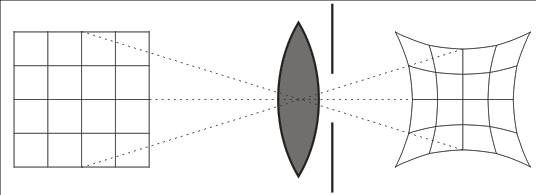
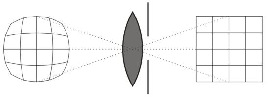
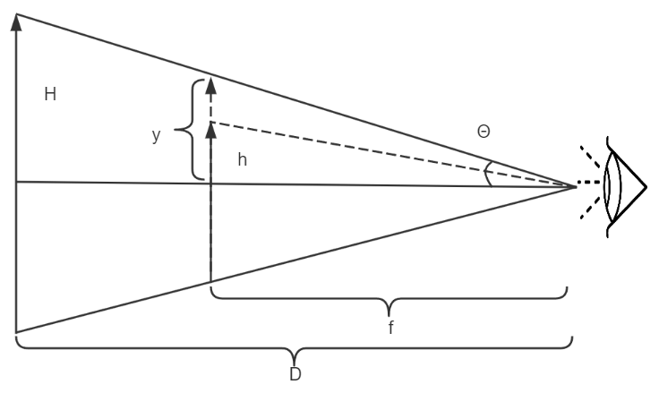
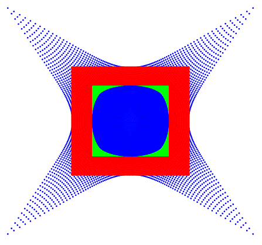

# VR光学畸变校正

VR虚拟现实光学畸变校正是VR头显厂家的核心技术之一，好的校正画面无畸变，转头时画面不会有扭动和变形，是VR提升沉浸感的关键点。本文就下面问题对VR畸变校正做了详细的阐述，可以了解其中的一些知识点：

1. **VR光学畸变校正是怎么做的？**

2. **光学FOV和渲染FOV是一样的吗？FOV怎么计算？Frustum怎么计算？**

3. **畸变预校正什么时候该用枕形，什么时候该用桶形？**

4. **显示画面的大小如何调整，怎么样让画面铺满整个屏幕？**

5. **Tan-Angle是什么，有什么用处？**

VR眼镜为了实现近眼成像，一般使用光学透镜来增加成像距离，但由于大部分透镜都存在畸变，会导致看到的画面呈枕形，如下图所示：



为了消除透镜带来的枕形畸变，VR眼镜厂家都会做畸变校正，即预先将屏幕显示的画面校正为桶形，用以抵消透镜所产生的枕形畸变，如下图所示：



畸变校正一般是通过光学透镜厂家提供的畸变数据来实现。通过Zmax仿真可以得出光学畸变参数，其格式如下表所示：

| Y Angle (deg) | Tan Shift | Sag Shift | Real Height | Ref. Height | Distortion |
|---------------|-----------|-----------|-------------|-------------|------------|
| 0 | -0.0744271 | -0.0744271 | 0 | 0 | 0% |
| 0.45 | -0.07432524 | -0.0742736 | 0.19616753 | 0.19617283 | -0.0027% |
| 0.9 | -0.07403927 | -0.0738131 | 0.39232744 | 0.39236987 | -0.01081% |
| 1.35 | -0.07356891 | -0.0730455 | 0.58847211 | 0.58861533 | -0.02433% |
| 1.8 | -0.07291369 | -0.0719707 | 0.78459392 | 0.78493345 | -0.04326% |
| 2.25 | -0.07207295 | -0.0705885 | 0.98068525 | 0.98134851 | -0.06759% |
| 2.7 | -0.07104585 | -0.0688987 | 1.17673846 | 1.17788483 | -0.09732% |
| 3.15 | -0.06983135 | -0.0669009 | 1.37274592 | 1.37456679 | -0.13247% |
| 3.6 | -0.06842822 | -0.064595 | 1.56869998 | 1.57141885 | -0.17302% |
| 4.05 | -0.06683507 | -0.0619804 | 1.76459302 | 1.76846556 | -0.21898% |
| 4.5 | -0.06505028 | -0.0590568 | 1.96041736 | 1.96573154 | -0.27034% |
| 4.95 | -0.06307207 | -0.0558237 | 2.15616535 | 2.16324155 | -0.32711% |
| 5.4 | -0.06089847 | -0.0522806 | 2.35182932 | 2.36102045 | -0.38929% |
| 5.85 | -0.05852734 | -0.0484269 | 2.54740158 | 2.55909324 | -0.45687% |
| 6.3 | -0.05595633 | -0.044262 | 2.74287444 | 2.75748508 | -0.52985% |
| 6.75 | -0.05318293 | -0.0397852 | 2.9382402 | 2.95622127 | -0.60825% |
| 7.2 | -0.05020443 | -0.0349959 | 3.13349114 | 3.1553273 | -0.69204% |
| 7.65 | -0.04701796 | -0.0298933 | 3.32861953 | 3.35482882 | -0.78124% |

表格中畸变类型是F-Tan(Theta)，其代表意义类似针孔相机，我们将光轴和穿过物点、透镜中心和像点的线之间的角度定义为θ。如果从针孔到图像平面的距离是f，那么图像高度y由y=f*tan（θ）给出。针孔透镜是无失真的，所以这个方程总是成立的。在实际的透镜是存在失真，失真被定义为实际图像高度和根据y=f*tan（θ）计算的理想图像高度之间的差。

表格中的Real Height可以对应到下图的h，即实际的物体高度。Ref. Height则是畸变后的高度，对应下图中y。其中H和D分别为虚像高和虚像距离。

表格中的Y Angle就是FOV了，可以通过公式θ=atan(y/f)计算得到，注意FOV在VR显示中非常重要，准确的FOV才能保证画面在转动的时候不会出现拉扯和变形。



由于每家厂商可能有自己的畸变校正算法，笔者就以开源的Monado OpenXR Runtime为例，实际看看畸变校正是如何完成的。Monado在Android平台上是使用google cardboard的畸变校正算法的，cardboard畸变校正算法是比较完善的，其核心原理类似于oculus最早开源的ovr sdk的畸变校正算法，能很好的处理图像缩放问题，保证画面能铺满整个屏幕。

下面这段代码是Monado初始化畸变参数结构体的部分，这里有几个重要参数。首先是angle参数，这个是FOV的一半，要根据实际的FOV来赋值。屏幕参数一般可以自己计算，通过屏幕像素和ppi可以计算出屏幕的以米为单位的宽和高等。畸变系数需要根据光学厂家给出的畸变参数来拟合，cardboard的拟合多项式为fact = 1 + k0  x^2 + k1 * x^4 + ...

screen_to_lens_distance_meters是屏幕到镜片的距离，一般可以由光学模组厂商给出来。

```c
const uint32_t w_pixels = metrics.width_pixels;
const uint32_t h_pixels = metrics.height_pixels;
const uint32_t ppi = metrics.density_dpi;

const float angle = 0.698132; // 40Deg in rads
const float w_meters = ((float)w_pixels / (float)ppi) * 0.0254f;
const float h_meters = ((float)h_pixels / (float)ppi) * 0.0254f;

struct u_cardboard_distortion_arguments args = {
    .distortion_k = {0.3498f, 0.7001f, 0.f, 0.f, 0.f},
    .screen =
        {
            .w_pixels = w_pixels,
            .h_pixels = h_pixels,
            .w_meters = w_meters,
            .h_meters = h_meters,
        },
    .inter_lens_distance_meters = 0.0384f,
    .lens_y_center_on_screen_meters = h_meters / 2.0f,
    .screen_to_lens_distance_meters = 0.02362998f,
    .fov =
        {
            .angle_left = -angle,
            .angle_right = angle,
            .angle_up = angle,
            .angle_down = -angle,
        },
};
```

畸变参数初始化后，会传到u_distortion_cardboard_calculate函数中进一步计算畸变所需要的参数。

```c
void
u_distortion_cardboard_calculate(const struct u_cardboard_distortion_arguments *args,
                                 struct xrt_hmd_parts *parts,
                                 struct u_cardboard_distortion *out_dist)
{
    uint32_t w_pixels = args->screen.w_pixels / 2;
    uint32_t h_pixels = args->screen.h_pixels;
    // Use the full screen.
    parts->screens[0].w_pixels = args->screen.w_pixels;
    parts->screens[0].h_pixels = args->screen.h_pixels;

    parts->views[0].viewport.x_pixels = 0;
    parts->views[0].viewport.y_pixels = 0;
    parts->views[0].viewport.w_pixels = w_pixels;
    parts->views[0].viewport.h_pixels = h_pixels;
    parts->views[0].display.w_pixels = w_pixels;
    parts->views[0].display.h_pixels = h_pixels;
    parts->views[0].rot = u_device_rotation_ident;
    parts->distortion.fov[0] = args->fov;

    // screen.size和offset参数比较重要，是转换uv坐标到屏幕空间的关键。
    l_values.screen.size.x = args->screen.w_meters;
    l_values.screen.size.y = args->screen.h_meters;
    l_values.screen.offset.x = (args->screen.w_meters - args->inter_lens_distance_meters) / 2.0f;
    l_values.screen.offset.y = args->lens_y_center_on_screen_meters;

    // 将screen尺寸转换到tanangle坐标，tanangle将屏幕半径和FOV转变为一个参数，简化了畸变处理的复杂度。
    l_values.screen.size.x /= args->screen_to_lens_distance_meters;
    l_values.screen.size.y /= args->screen_to_lens_distance_meters;
    l_values.screen.offset.x /= args->screen_to_lens_distance_meters;
    l_values.screen.offset.y /= args->screen_to_lens_distance_meters;

    // texture.size和offset是纹理的归一化系数，由FOV来决定，这个决定了纹理的铺满程度。所以FOV很关键，
    // 一方面用于渲染，决定渲染的视角大小，另一方面又用于畸变处理，决定画面显示的大小以及畸变校正后画面的拉扯、变形等因素。
  
    // Tan-angle to texture coordinates
    // clang-format off
    l_values.texture.size.x = tanf(-args->fov.angle_left) + tanf(args->fov.angle_right);
    l_values.texture.size.y = tanf(-args->fov.angle_down) + tanf(args->fov.angle_up);
    l_values.texture.offset.x = tanf(-args->fov.angle_left);
    l_values.texture.offset.y = tanf(-args->fov.angle_down);
    // clang-format on
}
```

上面就是整个Monado引擎畸变校正的流程，可以看出非常简洁和优美，代码逻辑非常清晰，这也是笔者重点推荐的原因。当然这个只是看到的开源算法实现，至于当前VR头显厂家的实现，可能也不尽相同，如高通的畸变校正，就使用外置的distortion mesh，将畸变参数的计算下放给了OEM厂家，不关心具体的计算过程，只需要提供最终的mesh映射表格即可，厂家tunning的灵活度就比较高。

畸变tunning的过程比较繁琐，需要理论和经验结合，有时候光学厂家给出的参数也不一定准确，需要判断是光学参数的问题还是tunning的问题。有的畸变校正使用的是枕形校正，而有的又使用桶形校正，具体该使用哪种需要根据自己的平台和畸变校正的算法原理来确定。不过不管是枕形还是桶形，其本质上还是一回事，只要掌握了核心原理，都是很简单的，下图是在tunning过程中生成的各种mesh图形，包括了桶形畸变和枕形畸变，以及两者相互的转换关系。


```