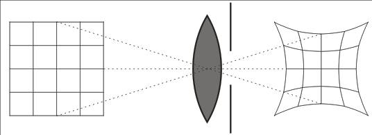
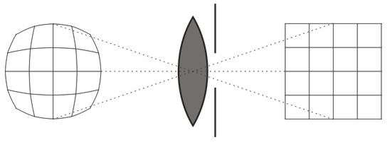

# Virtual Reality (VR) Optical Distortion Correction

VR optical distortion correction is one of the core technologies for VR head-mounted display manufacturers. Good correction results in a distortion-free image, and when the user moves their head, there is no twisting or deformation of the scene — essential for enhancing immersive experiences in VR.

This article will provide detailed explanations on several key questions related to VR distortion correction:

1. **How is optical distortion correction done in VR?**
2. **Are the optical FOV and rendered FOV the same? How do you calculate FOV and frustum?**
3. **When should you use pincushion distortion, and when should you apply barrel distortion for pre-distortion correction?**
4. **How is the size of the displayed image adjusted to ensure it fills the entire screen?**
5. **What is Tan-Angle, and what are its practical uses?**

---

## Overview of VR Optical Distortion

To achieve near-eye imaging, most VR glasses use optical lenses to increase the effective image distance. However, since most lenses introduce distortion, the resulting visual output appears distorted in a pincushion fashion (as shown below).



To eliminate the pincushion distortion caused by the lens, VR headsets perform **distortion correction** — typically by pre-distorting the image on the screen into a barrel-like shape such that it cancels out the lens-induced pincushion effect:



Distortion correction is generally achieved using distortion data provided by the lens manufacturer. These parameters can be derived through simulation tools like Zemax, with data formats often structured as follows.

---

### F-Tan(Theta) Distortion Model

The distortion type labeled "**F-Tan(Theta)**" corresponds to a pinhole camera model where the angle θ is defined between the optical axis and a line passing through an object point, the lens center, and the image point.

In this case, if f represents the focal length of the lens and y is the image height on the image plane, then:
)

This describes an ideal pinhole camera without distortion. In real-world lenses, distortion occurs due to imperfections; it's calculated as the difference between actual and ideal image heights.

| Y Angle (deg) | Tan Shift | Sag Shift | Real Height | Ref. Height | Distortion |
|---------------|-----------|-----------|-------------|-------------|------------|
| 0 | -0.0744271 | -0.0744271 | 0 | 0 | 0% |
| 0.45 | -0.07432524 | -0.0742736 | 0.19616753 | 0.19617283 | -0.0027% |
| 0.9 | -0.07403927 | -0.0738131 | 0.39232744 | 0.39236987 | -0.01081% |
| 1.35 | -0.07356891 | -0.0730455 | 0.58847211 | 0.58861533 | -0.02433% |
| 1.8 | -0.07291369 | -0.0719707 | 0.78459392 | 0.78493345 | -0.04326% |
| 2.25 | -0.07207295 | -0.0705885 | 0.98068525 | 0.98134851 | -0.06759% |
| 2.7 | -0.07104585 | -0.0688987 | 1.17673846 | 1.17788483 | -0.09732% |
| 3.15 | -0.06983135 | -0.0669009 | 1.37274592 | 1.37456679 | -0.13247% |
| 3.6 | -0.06842822 | -0.064595 | 1.56869998 | 1.57141885 | -0.17302% |
| 4.05 | -0.06683507 | -0.0619804 | 1.76459302 | 1.76846556 | -0.21898% |
| 4.5 | -0.06505028 | -0.0590568 | 1.96041736 | 1.96573154 | -0.27034% |
| 4.95 | -0.06307207 | -0.0558237 | 2.15616535 | 2.16324155 | -0.32711% |
| 5.4 | -0.06089847 | -0.0522806 | 2.35182932 | 2.36102045 | -0.38929% |
| 5.85 | -0.05852734 | -0.0484269 | 2.54740158 | 2.55909324 | -0.45687% |
| 6.3 | -0.05595633 | -0.044262 | 2.74287444 | 2.75748508 | -0.52985% |
| 6.75 | -0.05318293 | -0.0397852 | 2.9382402 | 2.95622127 | -0.60825% |
| 7.2 | -0.05020443 | -0.0349959 | 3.13349114 | 3.1553273 | -0.69204% |
| 7.65 | -0.04701796 | -0.0298933 | 3.32861953 | 3.35482882 | -0.78124% |

- **Real Height (h)**: The real object height.
- **Reference Height (y)**: The distorted height.
- **H**: Virtual image height
- **D**: Distance from lens center to virtual image plane

The Y Angle is equivalent to FOV, computed using:
)

Accurate FOV ensures that movement doesn’t cause stretching or deformation effects in the rendered view.

---

## Implementation Example Using Monado OpenXR Runtime

Open source VR runtime [Monado](https://monado.dev/) implements distortion correction using algorithms inspired by Google Cardboard and Oculus's OVR SDK. The implementation efficiently handles image scaling to ensure full-screen coverage.

### Key Parameters Used in Initialization:

```c
const uint32_t w_pixels = metrics.width_pixels;
const uint32_t h_pixels = metrics.height_pixels;
const uint32_t ppi = metrics.density_dpi;

const float angle = 0.698132; // 40 degrees in radians
const float w_meters = ((float)w_pixels / (float)ppi) * 0.0254f;
const float h_meters = ((float)h_pixels / (float)ppi) * 0.0254f;

struct u_cardboard_distortion_arguments args = {
    .distortion_k = {0.3498f, 0.7001f, 0.f, 0.f, 0.f},
    .screen =
        {
            .w_pixels = w_pixels,
            .h_pixels = h_pixels,
            .w_meters = w_meters,
            .h_meters = h_meters,
        },
    .inter_lens_distance_meters = 0.0384f,
    .lens_y_center_on_screen_meters = h_meters / 2.0f,
    .screen_to_lens_distance_meters = 0.02362998f,
    .fov =
        {
            .angle_left = -angle,
            .angle_right = angle,
            .angle_up = angle,
            .angle_down = -angle,
        },
};
```

In the structure above:
- The `.distortion_k` values are distortion coefficients obtained from optimization or provided by the lens manufacturer.
- `screen_to_lens_distance_meters`: Distance from screen to lens — usually given by the optical module vendor.
- FOV angles define the region of interest.

These parameters are passed into the following function for further processing:

```c
void
u_distortion_cardboard_calculate(const struct u_cardboard_distortion_arguments *args,
                                 struct xrt_hmd_parts *parts,
                                 struct u_cardboard_distortion *out_dist)
```

This sets up the screen and texture coordinate conversions and handles the distortion correction logic.

---

### Coordinate Transformation Logic

Screen dimensions are transformed into **tan-angle** space:
%20%3D%20%5Cfrac%7B%5Ctext%7Bdistance%7D%7D%7B%5Ctext%7Blens%20distance%7D%7D)

These transformations simplify handling of distorted coordinates while reducing math complexity.

Final texture parameters (offsets and sizes) are computed from fov values:
%20%2B%20%5Ctan(%5Ctext%7Bangle%5C_right%7D))
)

Similarly for Y-axis components.

This leads to:
```c
// Transform UV coordinates to tan-angle space
l_values.screen.size.x /= args->screen_to_lens_distance_meters;
l_values.screen.size.y /= args->screen_to_lens_distance_meters;
l_values.screen.offset.x /= args->screen_to_lens_distance_meters;
l_values.screen.offset.y /= args->screen_to_lens_distance_meters;

// Texture coordinates
l_values.texture.size.x = tanf(-args->fov.angle_left) + tanf(args->fov.angle_right);
l_values.texture.size.y = tanf(args->fov.angle_up) + tanf(-args->fov.angle_down);
l_values.texture.offset.x = tanf(-args->fov.angle_left);
l_values.texture.offset.y = tanf(-args->fov.angle_down);
```

---

### Pre-Distortion Calculation

The function `u_compute_distortion_cardboard()` defines how the distorted mesh coordinates are calculated based on the input texture UV and distortion data.

Input UV values (range: 0–1):
- Converted into **tan-angle space**
- Then squared, scaled by distortion factors using polynomial approximation:


After fact computation, it’s applied back to transform the UV coordinates.

Resulting pre-distorted UVs are re-normalized and returned for rendering.

---

## Additional Notes on Distortion Tuning

Distortion tuning is a complex process requiring both theoretical knowledge and practical experience. It involves adjusting distortion parameters until visual results match design goals.

Sometimes the provided lens data may not be accurate; therefore, one needs to distinguish between optical limitations and software tuning issues.

Depending on platform and algorithm, developers might choose either **pincushion correction** or **barrel distortion correction**, but both aim at the same goal – compensating for optical distortion.

Examples of distortion types used during development:
- Barrel distortion (used in pre-distortion)
- Pincushion distortion (inverse of barrel)

These transformations are interconvertible and can be applied depending on use-case and platform compatibility.

Below is an example graphic showing various mesh graphics from tuning:


---

## Conclusion

VR distortion correction plays a critical role in providing a comfortable and visually correct experience. The implementation involves precise handling of geometric transformations and distortion models derived from physical optics.

While open-source implementations like **Monado** offer elegant and clean codebases for educational and reference purposes, commercial solutions often vary significantly based on specific hardware integration and OEM preferences (e.g., Qualcomm’s mesh-based approach allows customization by vendors).

Mastering the principles behind optical distortion correction — whether via pincushion or barrel models — enables developers to build robust and high-quality VR systems with minimal performance penalty.